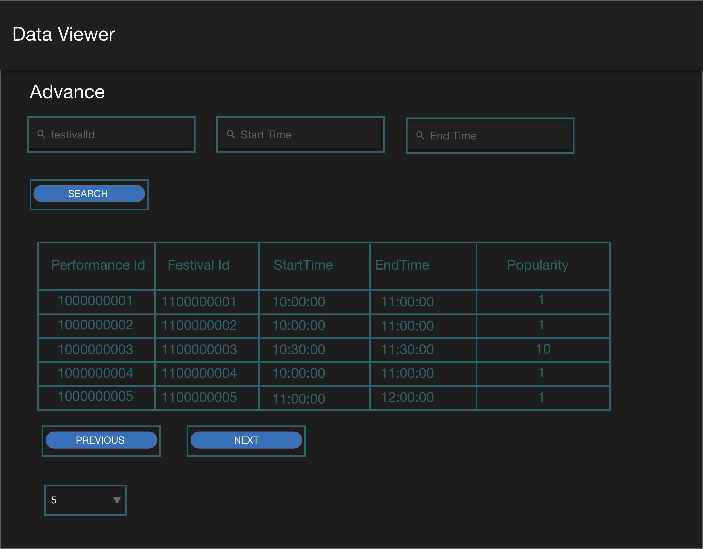

# Wireframe & Justification

This document should help you explain how your user interfaces are designed. You should have a wireframe to give a good overview and some screenshot with simple writeups to justify your designs.

## Wireframe

> This is just an example, please find your own wireframe.

## Justifications

### Justification 1

> This is just an example, please find your own justifications.

## References
Link: https://dribbble.com/shots/5673997-Gradient-Health-Imagery-Viewer/attachments

#### Good Points

1. The data in the table are presented neatly and it does not look so confusing to see.
2. There is a dashboard at the side thus it is easier for user to navigate different screens.

#### Bad Points

1. The ui of the data viewer is a bit dark. It will be better if the colour of the data table is not too similar as the background colour.
2. There is no pagination in the data table thus if user wish to see certain data, it will be difficult for them to scroll down the table and check one by one. This makes the website not user friendly at all.

### Justification 2

## References
Link: https://dribbble.com/shots/6559902-Untill-hospitality-management-platform-Reports/attachments

#### Good Points

1. The data in the table are presented neatly and it does not look so confusing to see.
2. There is a small calendar at the side and is easy for user to choose the date of data they wish instead of navigating to different screens.
3. There is pagination thus makes it more convinient for users to navigate different data sets instead of scrolling one by one to find the data they wish to see.

#### Bad Points

1. The ui of the data viewer is a bit plain and white and does not really attract the user's attention to view this data table. It will be better to add some colours.
2. There are too many components in this page, it will be better to minimise the amount of details in the webpage.

### Justification 3

##References
Link: https://dribbble.com/shots/7227376-Accounts-List-View/attachments/212811?mode=media

#### Good Points

1. The data are presented neatly thus it will be easy for user to look through the different attributes.
2. The webpage included three different filter and this allow users to select the section they want to see instead of scrolling one by one to find out.

#### Bad Points

1. The ui of the design is abit plain as it only use one to two colours. It will be difficult to attract the user's attention.
2. It will be better to include pagination for next page and previous page as it allows the users to navigate in a much easier way. 
