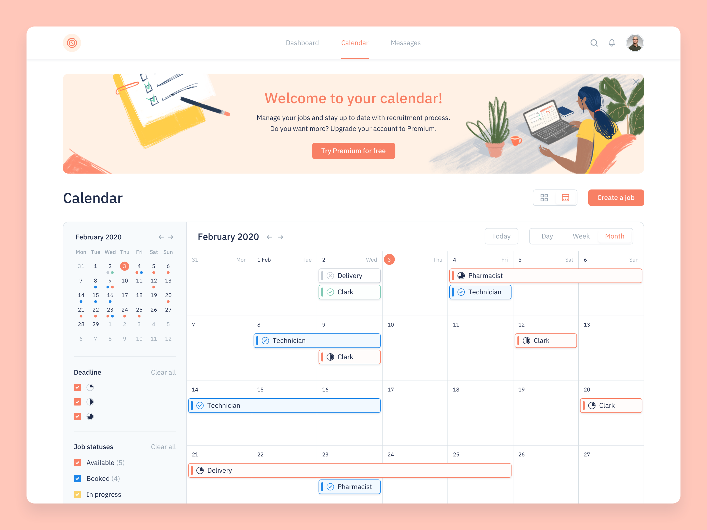
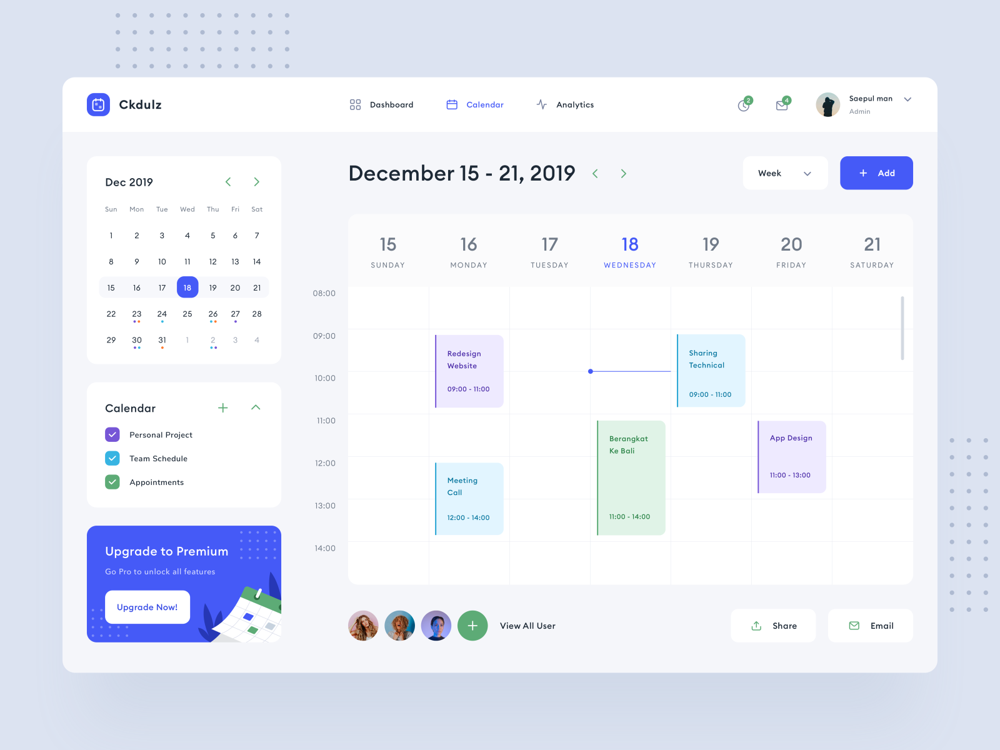
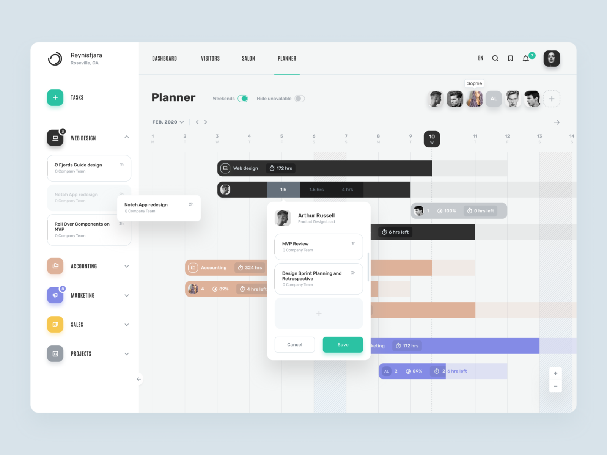

# Wireframe & Justification

This document should help you explain how your user interfaces are designed. You should have a wireframe to give a good overview and some screenshot with simple writeups to justify your designs.

## Wireframe

> This is just an example, please find your own wireframe.

## Justifications

### Justification 1

> This is just an example, please find your own justifications.

## References
Link: https://dribbble.com/shots/10768090-Calendar/attachments/2435605?mode=media

#### Good Points

1. The ui of the calendar is nice and it can attract users to view it.
2. Different events are presented in different colours thus it makes it easier to visualise it clearly.
3. It is good that the calendar can be filter in terms of day, week and month as it makes it more convienient for user to see the events.

#### Bad Points

1. It may not be easy to implement and code out as there are too many different functions in this calendar.

### Justification 2

## References
Link: https://dribbble.com/shots/9089543-Schedule-Dashboard-Design

#### Good Points

1. The ui of the calendar looks asthetic and neat. This makes it easier for user to look through the different upcoming events
2. Different events are represented using different colours which makes it easier for user to identify certain events.
3. The webpage have a filter and this allows users to choose certain week that they wish to see.
4. The calendar have a timeline at the side. This makes it more convienient for user to plan their events according to the time as well. 

#### Bad Points

1. The design may be hard to implement and code out due to the different functions.
2. It is better to include more colours in the webpge so that it would not look so plain.

### Justification 3

## References
Link: https://dribbble.com/shots/10797266--Planner-page

#### Good Points

1.  The differen events are presented in different colours. The title of the event were also included at the side of the webpage. User can just select from there as well.
2. The ui of the calendar is neat and is not confusing for user to see.

#### Bad Points

1. It will be better to include timeline either at the side or on top so that user can know the duration of the event such as the start time and end time.
2. The calendar does not have a filter to filter either week or month. It will be easier for user to see their events as well.