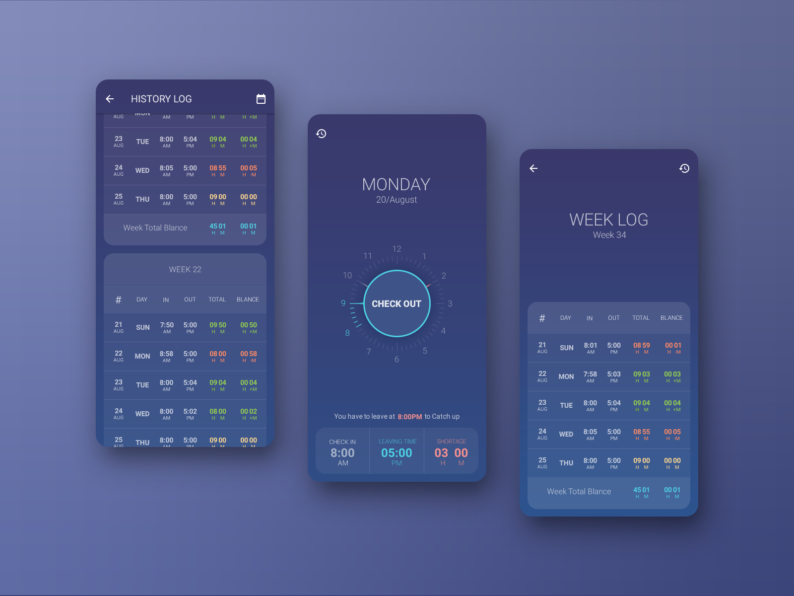
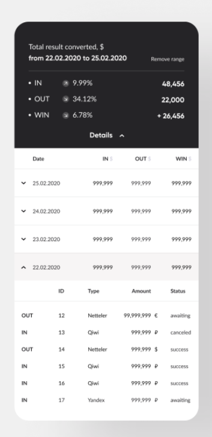
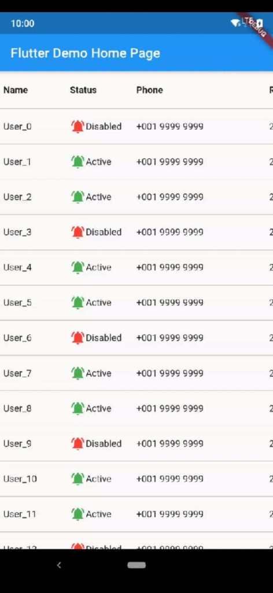

# Wireframe & Justification

This document should help you explain how your user interfaces are designed. You should have a wireframe to give a good overview and some screenshot with simple writeups to justify your designs.

## Wireframe

## Justifications

### Justification 1

## References
Link: https://dribbble.com/shots/8217323/attachments/591708?mode=media

#### Good Points

1. The ui of the data viewer is nice
2. The data is not too messy and user is able to scan through the data.

#### Bad Points

1. It will be better if they include pagination so that user do not have to scroll through the data viewer table and search for their data.
to search for particular data that they want to see.
2. The colour of the words in the header is same as the results. It will be better if the colour of the header is changed to something else. 

### Justification 2

## References
Link: https://dribbble.com/shots/11604619/attachments/3226072?mode=media

#### Good Points

1. It is good that they calculate the amount on top of the data viewer table so that the user can refer in a much easier way.

#### Bad Points

1. The ui of the data table is a bit plain.
2. There is no pagination in this data table. This will cause user to have trouble searching for the data that they want to see. It will be good to include a previous and next button at the bottom of the table in ordet to assist the user. The user would not need to spend time scrolling the whole data viewer table. 
3. It will be better to change the colour of the header to something else rather than the same colour as the results because this might confuse the user. 

### Justification 3

## References
Link: https://www.elasticfeed.com/72906c7026cdcbda72a5c1a104ddcf6d/

#### Good Points

1. The data in the table are being classified neatly which helps user to looking at the data.
2. The table seems easy to implement and code out.

#### Bad Points

1. There is no pagination in this data table. It will be better to have a filter or search button in this data table. User can search 
for the data easily. User would not need tp spend time searching for the data.
> See example in frontend wireframes
