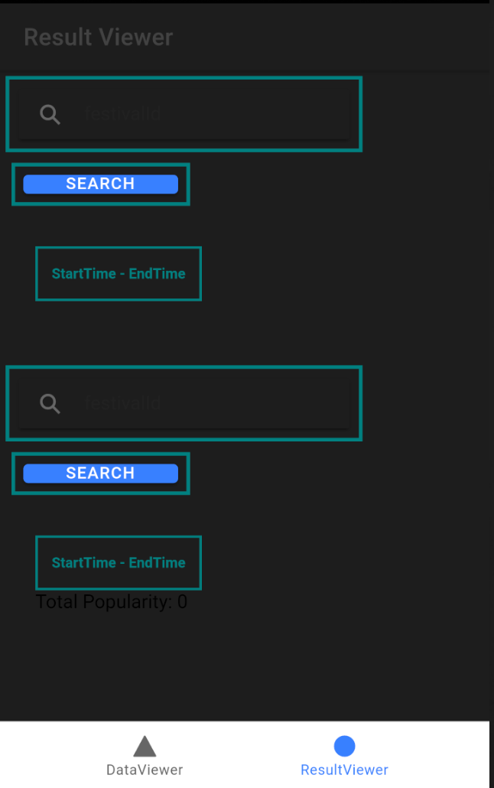
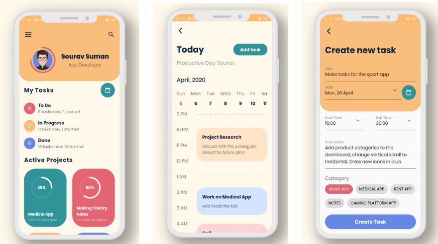
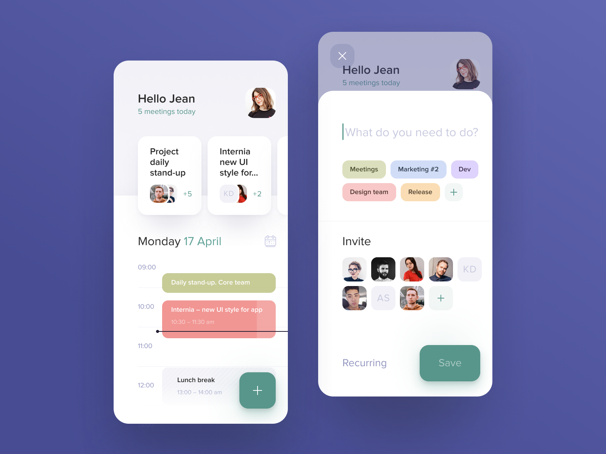

# Wireframe & Justification

This document should help you explain how your user interfaces are designed. You should have a wireframe to give a good overview and some screenshot with simple writeups to justify your designs.

## Wireframe

## Justifications

### Justification 1

## References
Link: https://flutterawesome.com/a-beautiful-task-planner-app-design-made-in-flutter/

#### Good Points

1. The ui of the schedule table is nice asthetic
2. The schedule does not look messy and is easy for the user to scan throug their schedules
3. Differnt events are represented in different colours thus is easy for users to identify their schedules.
#### Bad Points

1. It may be hard to code out and implement this calender as it has many functions.

### Justification 2

## References
Link: https://dribbble.com/shots/6322579-Schedule-page-for-Booking-app/attachmentsg

#### Good Points

1. The time is also being at the side which makes it easier for the user to plan their event as they can refer easily.
2. The ui of the design is nice and it can attract users to use.

#### Bad Points

1. The icon of the calendar should be brighter in order for users to see clearly.
2. It may be hard to implement and code it out due to differet functions.

### Justification 3

## References 
Link: https://dribbble.com/shots/12121013-Study-Mobile-App/attachments/3753704?mode=media

#### Good Points

1. The ui of the event schedule is nice.
2. The colours used is very pleasing for users to see.

#### Bad Points

1. It may be hard to code out and implement this event schedule table out.
2. The calendar is a bit small and is not too easy for users to see.
3. The events are represented with the same colours and it may be hard for users to identify.
4. It will be better to include a time column insead of users have to manually key in the time.

