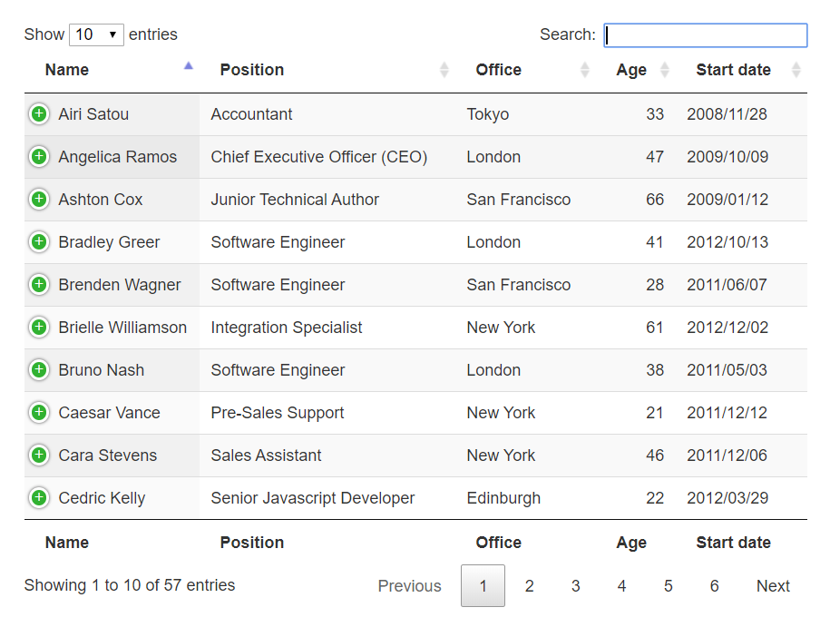
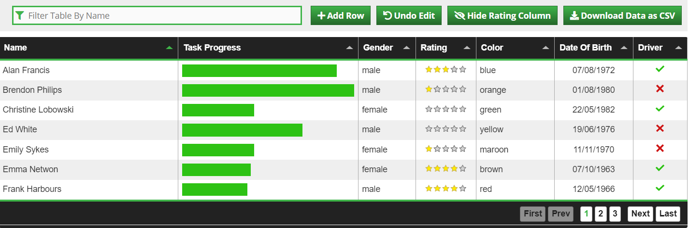
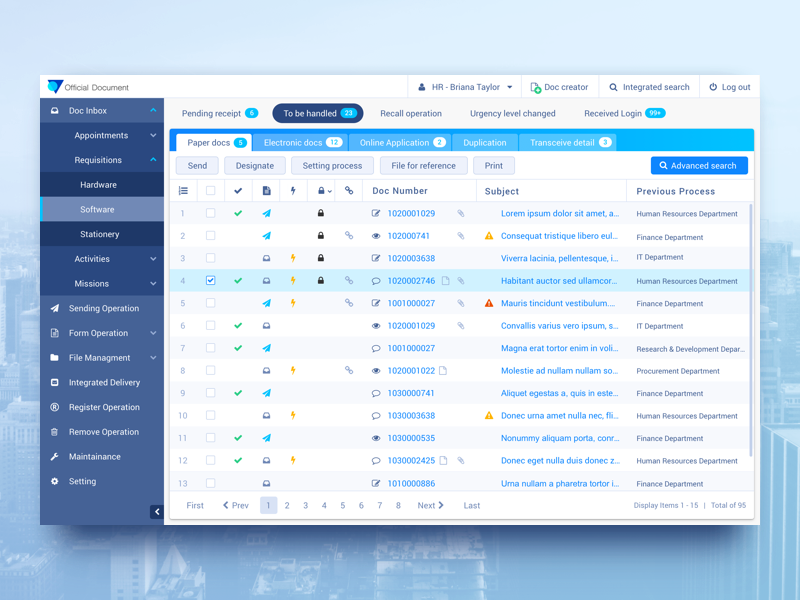

# Wireframe & Justification

This document should help you explain how your user interfaces are designed. You should have a wireframe to give a good overview and some screenshot with simple writeups to justify your designs.

## Wireframe

## Justifications

### Justification 1

### Reference
Link: https://datatables.net/

#### Good Points

1. Users are able to view and edit their information on the same page, it is quite convenient for them as they do not need to
navigate front and back in the web app. 
2. There is pagination so it will be easier for user to select that particular page of data the user wish to view.
3. A search button is included thus it is easier for user to search what they want instead of constantly need to scroll down
the table to find the data that they want. 

#### Bad Points

1. There are too many coloumns in this data table
2. It is quite confusing for users to view as there are too many informations being displayed in this table
3. The ui of the design seems a bit plain. It will be better if header is being highlighted instead of just words itself. 

### Reference
Link: http://tabulator.info/

#### Good Points

1. Showing pagination is easier for users to navigate the data table as well. The users do not need to constantly
click the next and last button to get to the page that they wish to view
2. The filter section is convienient for users as well, as it lessen down the time to search for the data that they
want
3. The table does not look messy and is presented clearly. The data are not cramped together as well. 
4. The colours used in this table are consistent and the ui of the data table is nice. 

#### Bad Points

1. It may be a challenge to implement this data table as there are too many functions in this data table, such as pagination
filtering, and other different kind of buttons.

### Justification 3

### Reference
Link: https://dribbble.com/shots/2815609-Official-Document-Office-system-grid

#### Good Points

1. It is good that the navigation bar is at the left side of the web app and is easier for users to navigate
2. Showing pagination is easier for users to navigate when there are too many informations being displayed on the table

#### Bad Points

1. There are too many coloumns being displayed in this data table
2. There are too many informations and navigations this web app, thus making this web app look very messy.
 It may cause the users to get confused when looking through the data.
