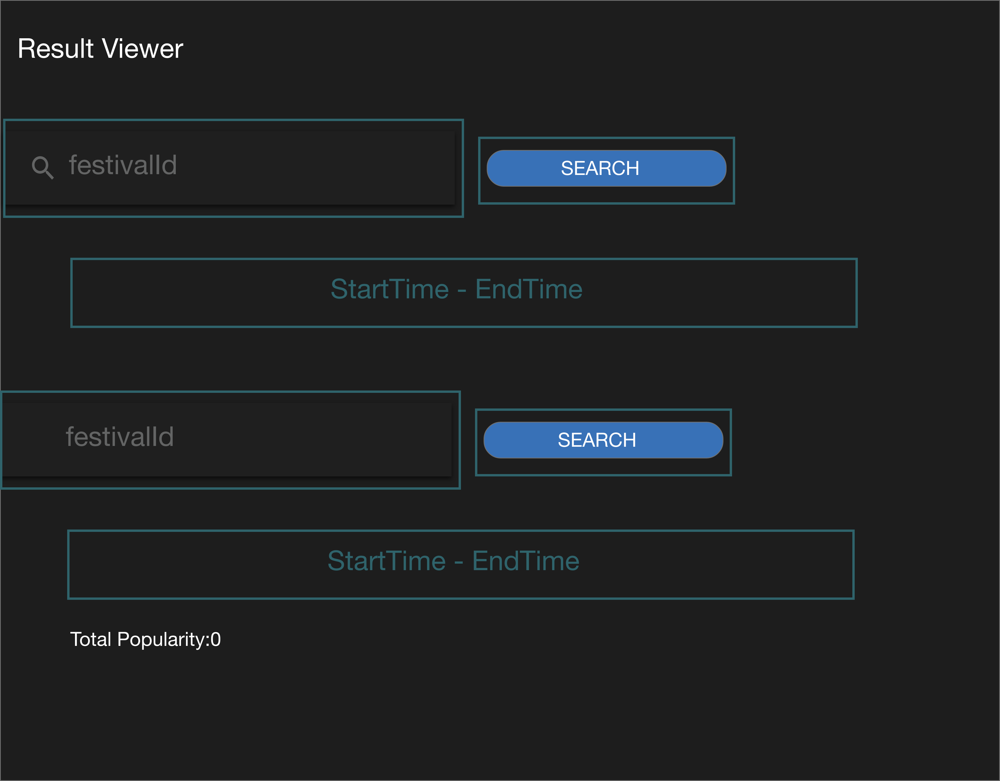
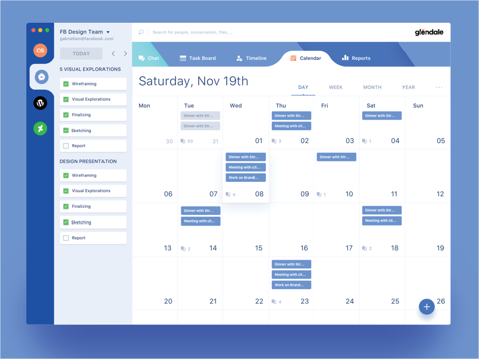
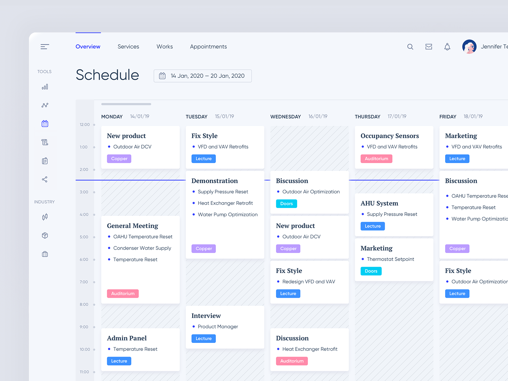
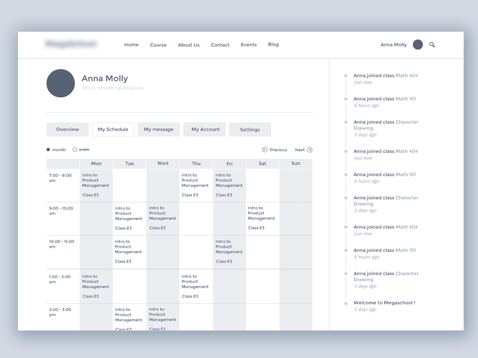

# Wireframe & Justification

This document should help you explain how your user interfaces are designed. You should have a wireframe to give a good overview and some screenshot with simple writeups to justify your designs.

## Wireframe

## Justifications

### Justification 1

## References
Link: https://dribbble.com/shots/4071564-Software-UI-Exploration

#### Good Points

1. The UI is nice and it can attract users to use this schedule to plan their events.
2. The navigation bar is at the side of the webpage thus making it easier for users to navigate.

#### Bad Points

1. The colours are mostly the same, it will be difficult for users to differenciate their schedules for each day properly
2. May be hard to code out this whole calendar as there are too many functions in this webpage.

### Justification 2

## References
Link: https://dribbble.com/shots/10737826-ATOM-Wireframe-UI-KIT/attachments/2405571?mode=media

#### Good Points

1. The design of the schedule is nice
2. The schedule looks neat and is easy for users to see and plan their schedules properly. 
3. The time is also being displayed at the left of the schedule table as well. 

#### Bad Points

1. The schedule may be hard to implement.
2. Too many colours are being used, for example, the colour of the bullet point should be the same as 
button below the words. It may confuse the users when both colours are differnt. 

### Justification 3

## References
Link: https://cdn.dribbble.com/users/565942/screenshots/1776385/calendar.png

#### Good Points

1. It may be easy to implement since the design is quite simple.
2. Pagination is included such as previous and next. It is easy for users to find the schedule that they plan.

#### Bad Points

1. The design of this schedule table is too plain and is not easy to attract users to even use this web app to plan
their schedule. 
2. The colours are too plain. It will be better to include some colours certain of the day such as red, to
get the user's attention. 