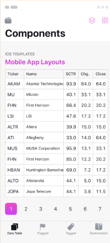
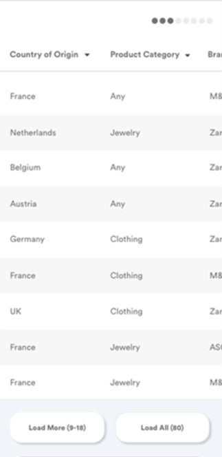
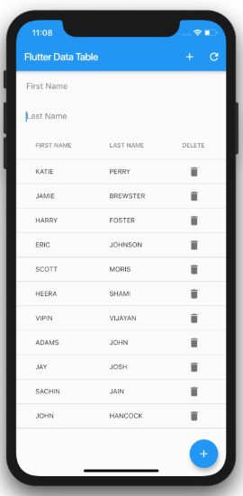

# Wireframe & Justification

This document should help you explain how your user interfaces are designed. You should have a wireframe to give a good overview and some screenshot with simple writeups to justify your designs.

## Wireframe

## Justifications

### Justification 1

## References
Link: https://www.pinterest.com/pin/482307441341558745/

#### Good Points

1. The ui of the data viewer is nice
2. The data is very clear to read as it the data is being distributed neatly.
3. Pagination is being shown thus making it easier for users to search for the data that they want.

#### Bad Points

1. May need to include a search bar. Based on the pagination, there are many pages. The search bar helps the user
to search for particular data that they want to see.
2. The colour of the table is almost the same as the background colour, it will be better to changed the colour
of tbe background. 

### Justification 2

## References
Link: https://dribbble.com/shots/4846265-Mobile-Dashboard-Data-Table

#### Good Points

1. The data table is neat and easy for user to view the data in this format. 
2. The words in the data table are not being cramp together as well which makes it even easier for user
to read the data table

#### Bad Points

1. The ui of the data table is a bit plain.
2. The header of the table is not labelled and is hard to differenciate whether is that even the header or they are the 
data results. It will be better if the header is being labelled. 
3. There is no pagination in this data table. This will cause user to have trouble searching for the data that they
want to see. It will be better to include a previous and next button at the bottom of the table in ordet to assist the user
in finding the data they want to see. 

### Justification 3

## References
Link: https://www.elasticfeed.com/72906c7026cdcbda72a5c1a104ddcf6d/

#### Good Points

1. The ui of this data table seems pleasent to see.
2. The data in the table are being classified neatly which helps user to looking at the data.
3. The table seems simple to code and implement out. 

#### Bad Points

1. There is no pagination in this data table. It will be better to have a filter or search button in this data table. User can search 
for the data easily. 
