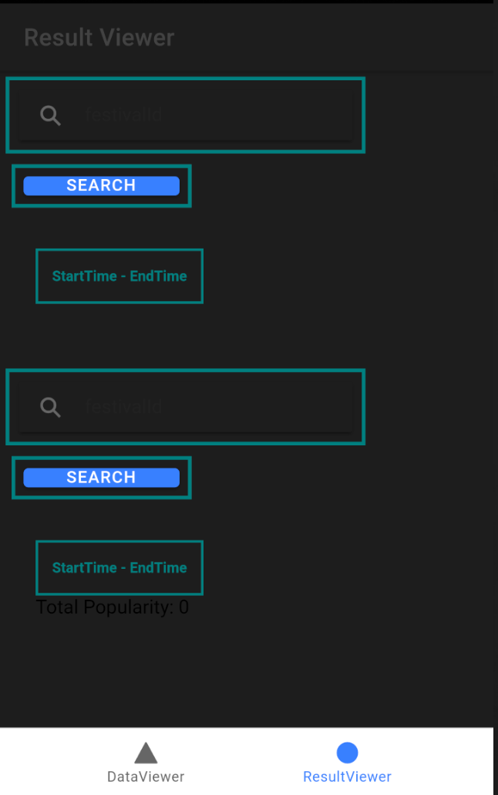
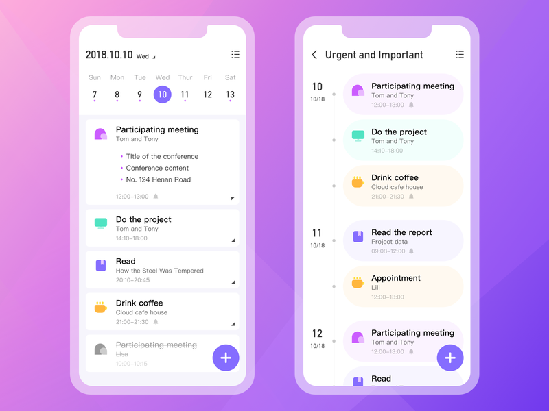
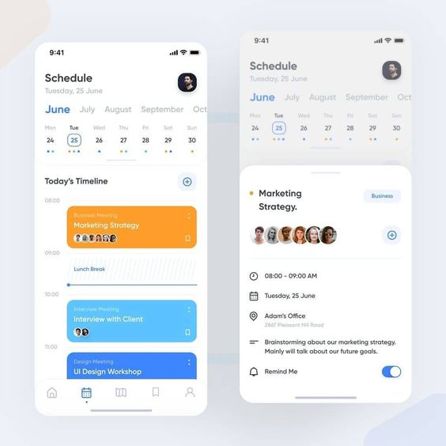
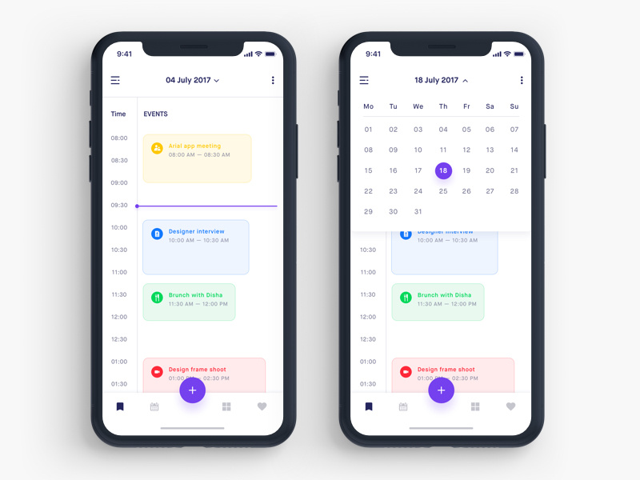

# Wireframe & Justification

This document should help you explain how your user interfaces are designed. You should have a wireframe to give a good overview and some screenshot with simple writeups to justify your designs.

## Wireframe

## Justifications

### Justification 1

## References
Link: https://cdn.dribbble.com/users/2012118/screenshots/5538098/calendar_4x.png?compress=1&resize=800x600

#### Good Points

1. The ui of the schedule table is nice
2. The schedule does not look messy and is clear for the users to see.
3. The day and date are displayed togther which is easier for user to  plan and see their schedule properly.

#### Bad Points

1. It may be hard to code out and implement this calender.

### Justification 2

## References
Link: https://i.pinimg.com/564x/89/d9/0a/89d90a5dc88d674ea70b168b6a8ffab5.jpg

#### Good Points

1. The ui of the schedule table is nice.
2. The time is also being displayed which makes it more easy for users to plan their schedule properly

#### Bad Points

1. There too much information on the mobile page. It is not neccessary to include the all the months on the same page
as it can be too messy. 
2. Too many informations are being cramped together as well \. 

### Justification 3

## References 
Link: https://cdn.dribbble.com/users/1055247/screenshots/4786565/todo_calendar.jpg

#### Good Points

1. The ui of the event schedule is nice and attractive
2. It is clear for users to see as every event uses different colour to represent it. 
3. Time is included as well which is better for users to take not of the schedule istead of typing it the time
manually out. 

#### Bad Points

1. It may be hard to code out and implement this event schedule table out.

